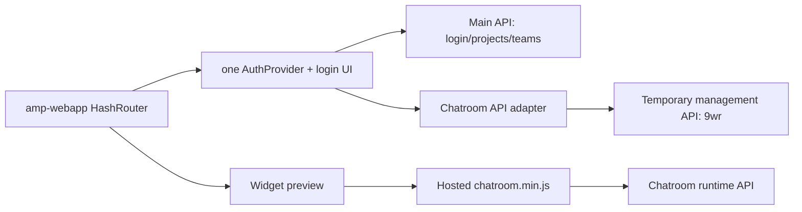

# Merge Chatroom Editor into `amp-webapp`

## TL;DR

Move the chatroom list, settings editor, usage view, embed-script generator,
and widget preview into `amp-webapp` as protected routes. Reuse the main
Stimulize login and token; do not copy the standalone chatroom login or its
localStorage state. Keep chatrooms standalone from projects and teams.

Develop against the current chatroom management API as a configurable second
origin, but do not call that the final production architecture. Production
should eventually serve chatroom management routes from the main Stimulize
API.

## Verified API/Auth Facts

- Main editor API: `q15.../live`. It currently returns backend 404 for
  `POST /api/getChatrooms`; chatroom routes are not deployed there.
- Chatroom management API: `9wr.../live`. It exposes the chatroom routes.
- A token minted by the main API was accepted by the chatroom API and could
  list the same user's chatrooms. Both services currently share compatible
  Flask-Security token validation.
- Backend token max age is 12 hours. Keep the main editor's single
  `stimulize_auth` state; remove the chatroom editor's separate 3-hour state.

Temporary target flow:



## Feature Scope

Port all existing editor behavior:

- owner-only list/create and edit/save/status
- participant counts, replacement/wait behavior, avatars, resumable setting
- model, temperature, prompt, personas, timer settings and normalization
- token-usage totals, period chart and table
- Qualtrics embed-script generation
- multiple widget previews and history inspection

Do not port:

- standalone `App.tsx`, header, login box, `managementAuth.ts`, Vite entrypoint,
  or build-time username/password/token support
- widget source or runtime backend into `amp-webapp`
- project/team linkage; chatrooms remain standalone user-owned resources

## Auth Integration (P0)

The main auth module is reusable, but harden it before adding chatroom traffic:

1. Remove request/login/register payload logging; it currently logs passwords.
2. Register the window storage listener once in `AuthProvider.useEffect` and
   return its cleanup. It is not tied to an element ref; `setAuthState` is a
   stable React setter and is the only dependency. Notify subscribers for
   same-tab `setAuth`/`clearAuth`, not only browser `storage` events from other
   tabs.
3. Reject pending login waiters when the modal is cancelled. Deduplicate
   concurrent login prompts and permit at most one retry after a 401.
4. Add a reusable protected-route component and preserve `returnTo` through
   login. Chatroom pages must never render an empty unauthenticated list.
5. Expose one typed authenticated POST client. Keep the raw
   `Authorization: <Flask-Security-token>` header; do not add `Bearer`.
6. Treat backend 401 as authoritative. The client TTL is only an early local
   expiry check.

Chatroom code consumes this client and `AuthContext`; it must not read or
write its former `stimulize.editor.managementAuth` key.

## API and Build Adaptation

Add CRA environment configuration:

```text
REACT_APP_API_BASE
REACT_APP_CHATROOM_MANAGEMENT_API_BASE
REACT_APP_CHATROOM_RUNTIME_API_BASE
REACT_APP_CHATROOM_WIDGET_URL
```

During beta, `CHATROOM_MANAGEMENT_API_BASE` may point to `9wr.../live` while
sharing the main token. Beta acceptance must verify CORS from the actual
Stimulize beta/production origins. Before production, prefer deploying the
chatroom management routes behind `REACT_APP_API_BASE`; then remove the second
origin.

Other required adaptations:

- replace `import.meta.env` with CRA config
- use the existing `react-router` package and HashRouter
- replace Vite base-path URL construction with router/location helpers
- keep React 18 and the existing Arco version; do not introduce a nested app
- convert `chatroomSetting` tests from Vitest to Jest
- give chatroom pages an explicit left-aligned page container because the main
  app globally centers `.App`
- keep the widget bundle externally hosted in phase 1; the main build only
  stores its configured URL

Suggested target structure:

```text
amp-webapp/src/component/chatroom/
  ChatroomList.tsx
  ChatroomEditor.tsx
  ChatroomUsage.tsx
  ScriptGenerator.tsx
  WidgetPreview.tsx
amp-webapp/src/data/chatroom.ts
amp-webapp/src/data/chatroomSetting.ts
```

## Workspace Navigation and Routes

Insert a horizontal Arco `Menu` between the existing header and workspace
content. Start with:

- `Experiments` -> `/my`; also selected for `/exp/:expId/edit`
- `Chatrooms` -> `/chatroom`; selected for every `/chatroom/*` route

This is application-level tool navigation, not project navigation. Teams can
be added later without changing route ownership. Guest `/exp` may retain its
current behavior; selecting a protected menu item goes through the normal
login/return-to flow.

Use short top-level routes:

```text
#/chatroom
#/chatroom/:id
#/chatroom/:id/usage
```

Do not use `/my/chatroom/:id`: `/my` is the current experiment dashboard, not
a namespace or parent resource for chatrooms.

## Implementation Order

1. Harden shared auth and add tests for same-tab/cross-tab state, cancel,
   concurrent 401, one retry, logout, and return-to routing.
2. Add configurable API bases and typed chatroom API wrappers.
3. Port setting normalization/tests, then pages/components without the
   standalone shell/auth code.
4. Add protected routes, navigation, and layout containment.
5. Build and run browser E2E in beta: login once, open Chatrooms without a
   second prompt, create/edit/save, inspect usage, generate a script, and run a
   preview with total duration below one minute.
6. Deploy beta first. Production waits for an explicit decision on whether
   chatroom management remains a second origin or moves behind the main API.

## Acceptance Criteria

- One login and one localStorage auth record serve projects, teams, and
  chatrooms; logout/expiry applies to all.
- No credential or request-body logging and no unbounded login retry/waiter.
- Direct/deep-link chatroom routes preserve login return location.
- Feature parity with the standalone editor, including usage, generated
  script, preview, and resumable participant-ID prompt.
- `amp-webapp` tests/build pass; no Vite-only code or second React/router copy.
- Beta browser E2E passes against configured management/runtime/widget URLs.

## Deferred

- HttpOnly-cookie or stronger auth redesign
- chatroom sharing, project/team ownership, or subscription feature gates
- merging widget source/build into `amp-webapp`
- deleting the standalone editor before beta soak and parity verification
