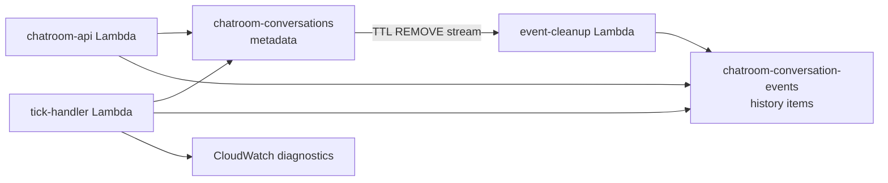

# Conversation Event Storage LLD

## Purpose

Implementation plan for
[`feat-conversation-event-storage.md`](./feat-conversation-event-storage.md).
That document owns product and one-way-door decisions; this document maps them
to the current codebase. Resume behavior remains a later feature.

## Status

Implemented and verified on the isolated prefix
`stimulize-chatroom-event-dev-yjx-20260725`. No beta stack, table, API, or
widget was updated. The deployed dev API passed a browser message/AI-response
flow, and a disposable AWS migration rehearsal passed twice idempotently. Live
migration and beta cutover remain pending.

## Target Flow



`chatroom-conversations` remains the lifecycle, settings, participant, tick,
and retention row. The new table owns ordered participant-visible history.
Both use `conversation_id`; no second conversation identity is introduced.

## DynamoDB Contract

### Conversation metadata

Keep the existing PK and `status-index`. Add:

```text
event_storage_version = 1
ai_tick_state_by_participant_id
next_actionable_tick_at
```

For each AI, tick state may contain:

```text
last_completed_tick_id
last_evaluated_at
last_result                 # silent | spoke | error
last_spoke_at
observed_history_cursor
consecutive_silent_count
next_actionable_at
```

Only accepted history and explicit lifecycle writes update `updated_at` and
refresh `ttl`. Tick guards and projection-only updates do neither.

Enable PITR, `RETAIN`, TTL stream `KEYS_ONLY`, and keep the existing 2.5-year
metadata TTL. Preserve the legacy `events` list through the migration soak.

### History items

```text
table: chatroom-conversation-events
PK: conversation_id
SK: event_key
key: H#T{timestamp:016d}#B{batch_id}#I{index:03d}
billing: PAY_PER_REQUEST
PITR: enabled
removal policy: RETAIN
TTL/GSI: none
```

Common item fields:

```text
conversation_id, event_key, event_id, event_stream, schema_version
type, subtype?, audience, role
session_id?, participant_id?, ai_participant_id?
sender?, internal_name?, avatar?, content?
timestamp, authored_at?, created_at
```

Phase 1 writes only `audience="conversation"`; reject private/selected
audiences until read authorization filtering exists.

Author rules:

- Non-resumable human: `role=human`, author is `session_id`.
- Resumable human later: also store `participant_id`; it becomes the author,
  while `session_id` records the source connection/session.
- AI: generate `ai_participant_id` at conversation creation and bind it to the
  resolved persona snapshot. Reuse it across episodes. Names are labels only.
- System: no author ID; use `subtype` for machine-readable meaning.

New AI participant rows use `ai_participant_id` rather than overloading
`session_id`. Human participant rows continue using `session_id`. Existing RDS
usage rows may still place the AI ID in their legacy `session_id` column.

### Ordering and idempotency

- The server assigns `timestamp`; it is both history order and availability.
- `index` preserves order inside one batch.
- Same-time separate batches use deterministic arbitrary `batch_id` order.
- `event_id = "{batch_id}#{index}"`.
- One transaction supports at most 25 history events, comfortably below the
  DynamoDB 100-action/4-MB limits.
- Use `batch_id` as `TransactWriteItems.ClientRequestToken` and condition each
  event put on key absence. On a duplicate-key cancellation, read the existing
  batch: identical canonical payload means success; different payload is a
  corruption error.

## Backend Structure

Add:

```text
backend/chatroom_api/event_store.py         # real DynamoDB history adapter
backend/chatroom_api/mock_event_store.py    # in-memory contract equivalent
backend/chatroom_api/legacy_event_store.py  # pre-cutover embedded-list adapter
backend/chatroom_api/cursors.py             # opaque cursor encode/decode
backend/chatroom_api/event_cleanup.py       # TTL stream consumer
backend/scripts/migrate_conversation_events.py
```

Update `config.py` with `DYNAMODB_EVENT_TABLE` and
`EVENT_STORAGE_ENABLED`. `get_event_store_provider()` selects the new table only
when a real stack explicitly enables it; existing stacks remain on the legacy
adapter until cutover. Keep `dynamo.py` focused on metadata reads, tick guards,
and projection updates; remove embedded-list operations only after soak cleanup.

The real and mock adapters expose:

```python
create_conversation(metadata, history_events, batch_id)

append_history_batch(
    conversation_id,
    history_events,
    batch_id,
    metadata_updates=None,
    expected_status=None,
)

update_tick_projection(
    conversation_id,
    ai_participant_id,
    tick_state,
    expected_status=None,
)

query_live_after(conversation_id, after_cursor, now_ms, limit)
query_history_before(conversation_id, before_cursor, now_ms, limit)
query_prompt_events(conversation_id, now_ms)
query_next_pending(conversation_id, after_cursor, now_ms)
```

`create_conversation` and `append_history_batch` use `TransactWriteItems` so
metadata and visible history cannot diverge. `query_prompt_events` paginates
past DynamoDB's 1-MB response boundary; do not silently truncate prompts.

Cursor payload is base64url JSON without padding:

```json
{"v":1,"stream":"history","conversation_id":"conv_...","event_key":"H#..."}
```

Reject malformed, wrong-version, wrong-stream, and cross-conversation cursors
with `400 invalid_cursor`.

## Write Paths

### Conversation creation

In `close_lobby.py`:

1. Resolve human and AI participants as today.
2. Generate each AI's `ai_participant_id` and snapshot persona, model,
   temperature, internal name, display name, and avatar.
3. Log lobby diagnostics to CloudWatch instead of storing `lobby_created`.
4. Transactionally put metadata plus participant-visible start/join events.
5. Mark the lobby closed only after that transaction succeeds.

The existing lobby `closing` conditional keeps creation idempotent. A retry
uses the same deterministic creation `batch_id` derived from `conversation_id`.

### Human send

In `chat.py`:

1. Validate conversation/status and resolve the human from JWT `session_id`.
2. Build one immediate history event with server `timestamp`.
3. Append it with a fresh `batch_id`; refresh metadata TTL in the transaction.
4. Keep the current best-effort immediate assistant tick.
5. Do not reread the complete conversation row to form the response.

Client-send idempotency remains at-least-once until `client_message_id` is
implemented.

### Tick

In `tick_handler.py`, query visible history separately and pass it explicitly
to gate, prompt, follow-up, and Bedrock-message helpers. Those pure helpers must
stop reading `conv["events"]`.

- Gate skip: structured CloudWatch log only.
- Silent/error decision without participant-visible output: update projection
  only.
- Participant-visible server error: append one `H#` system event and update the
  projection transactionally.
- AI output: acquire a 125-second conversation tick lease, wait each 2-8 second
  typing delay, then append that bubble with `timestamp=server now`,
  `authored_at=model completion time`, `turn_id`, and `ai_participant_id`.
- Every append and the final projection update require the same active tick ID
  and active status. Drop remaining output if either condition is stale.
- Limit one model turn to five bubbles, fitting at most 40 seconds of typing
  delay inside the 120-second Lambda timeout.
- End: conditionally change status and append the end boundary in one
  transaction. No new tick starts afterward.

Usage is recorded once Bedrock returns, before presentation delay, and remains
billable even if a later stale guard drops the output. The new runtime never
pre-writes future events; migration alone may preserve legacy future events.

## Read API and Widget

### Routes

Keep and extend:

```http
GET /chat/messages?after=<cursor-or-legacy-timestamp>&limit=100
GET /chat/history?before=<cursor>&limit=50
```

`/chat/messages` returns ascending visible history:

```json
{
  "events": [],
  "next_after": "opaque-or-null",
  "has_more": false,
  "next_pending_at": null,
  "conversation_status": "active",
  "lobby": null
}
```

For a numeric legacy `after`, query strictly after that timestamp and retain
the current `events`, `conversation_status`, and `lobby` fields. Cursor fields
are additive. A maintenance window does not expire JavaScript already loaded
by an open page. Remove nonzero numeric timestamps only after the longer of the
current three-hour JWT lifetime or the GitHub Pages 10-minute cache freshness
plus the longest supported active widget session, and after rollout soak shows
no legacy traffic. `after=0` may remain as the lobby/initialization sentinel.

`/chat/history` queries backward, reverses each page into display order, and
returns `next_before`, `has_more`, and `latest_cursor`. It never returns future
events.

When an ended conversation still has future history, `next_pending_at` tells
the new widget to keep polling. It processes the final delayed event before
stopping. This requires one small next-item query only on the ended path.

Remove `include_ticks`; durable tick diagnostics no longer exist.

### Frontend changes

In `frontend/src/data/{api,state,types}.ts`:

- replace `lastTimestamp` with `liveCursor`
- use `event_id` as the primary dedupe key
- keep sender/content/timestamp/role dedupe only as migration fallback
- use `timestamp`; remove `visible_at` timers
- load the newest history page on entry and expose `loadOlderHistory()`
- request older pages when the message scroller approaches its top
- on `ended`, continue polling while `next_pending_at` is present

Lobby polling may continue using `after=0`; it ignores history. Existing
Qualtrics history formatting remains driven by the rendered history array.

## Infrastructure and Cleanup

Add `cdk/lib/conversation-event-stack.ts`:

- create the event table
- create the cleanup Lambda and failure queue/alarm
- consume metadata-table `REMOVE` records
- query and batch-delete the full event partition, following pagination
- treat missing/already-deleted partitions as success

Production cutover will update:

- `conversation-table-stack.ts`: PITR, `RETAIN`, `KEYS_ONLY` stream
- `chatroom-api-stack.ts`: event-table env/grants and `/chat/history`
- `tick-handler-stack.ts`: event-table env/grants
- `cdk/bin/app.ts`: stack wiring
- `cdk/test/snapshot.test.ts`: tables, stream, Lambda, IAM, route, alarms

Set event cleanup and tick diagnostic logs to 30-day retention. Cleanup must
never delete conversation metadata.

For development, `cdk/bin/event-storage-dev.ts` creates a separate six-stack
graph and rejects names that do not start with
`stimulize-chatroom-event-dev-`. It uses mock management data by default and
omits the heartbeat unless explicitly enabled. To test chatrooms created in the
production editor, `useProdRds=true` reuses the existing production RDS endpoint
and Secrets Manager credential; this also writes real inference usage rows to
that database:

```bash
cd cdk
npm run synth:event-dev -- -c devPrefix=stimulize-chatroom-event-dev-<name>
npm run deploy:event-dev -- -c devPrefix=stimulize-chatroom-event-dev-<name> --require-approval never

# Explicit shared-RDS integration mode
npm run deploy:event-dev -- \
  -c devPrefix=stimulize-chatroom-event-dev-<name> \
  -c useProdRds=true \
  -c enableDevHeartbeat=true \
  --require-approval never
```

The isolated heartbeat scans only the prefixed dev metadata table and ticks at
an eight-second interval. Keep it disabled for storage-only development.

## Migration Tool

The CLI defaults to read-only `--dry-run` and requires explicit source/target
table names and AWS region. `--apply` requires `--confirm-plan <full-hash>`.
Known beta table names are refused by default.

For each legacy conversation:

1. Preserve participant-visible `message`, `system`, and `error` events.
2. Drop `tick` and `lobby_created`, count them, and derive the latest per-AI
   projection.
3. Map `timestamp = visible_at ?? timestamp`; add `authored_at` only when the
   original timestamp differs.
4. Map AI author from `ai_participant_id ?? session_id`; leave legacy human
   authors on `session_id` and system events without an author.
5. For equal migrated timestamps, use one deterministic UUIDv5 batch and old
   list order as `index`; this preserves legacy display order.
6. Idempotently put event items, verify canonical hashes/counts, then set
   `event_storage_version=1`. Verify that legacy `events` remains unchanged for
   rollback; do not append to it after cutover.

Write a checkpoint after each verified conversation. A rerun must produce the
same plan hash and no changes.

Disposable AWS rehearsal:

```bash
cd backend
.venv/bin/python scripts/rehearse_conversation_event_migration.py \
  --prefix stimulize-chatroom-event-rehearsal-<unique-name> \
  --region us-east-2
```

The harness seeds legacy-shaped synthetic data, applies twice, verifies, and
deletes all three temporary tables unless `--keep` is supplied.

## Verification

Backend tests:

- event key, cursor validation, author normalization, equal-time ordering
- real/mock adapter contract and transaction idempotency/corruption behavior
- live/history pagination across 1-MB pages and future timestamps
- human, AI, system, silent, error, and end write paths
- prompt/gate equivalence using explicit queried history
- numeric `after` compatibility and soft-end pending delivery
- cleanup pagination/retry/idempotency
- migration dry-run/apply/verify/rerun with malformed fixtures

Frontend/CDK checks:

- TypeScript build and cursor/event-ID state tests
- scrollback and soft-end polling browser flow
- CDK Jest snapshots and `cdk synth`

Acceptance sequence:

1. Run all local backend, frontend, and CDK tests.
2. Run a local browser conversation under one minute with mock storage.
3. Rehearse migration against restored temporary tables and record duration.
4. Stop. Beta freeze, backup, migration, and cutover require a separately
   reviewed operation; they are not part of development-stack verification.
5. After that future cutover, keep numeric polling compatibility for the
   documented cache/session/JWT window and soak before removing it or legacy
   embedded lists.

## Work Plan

1. **Storage foundation**
   - CDK event table/stream/cleanup and snapshots
   - cursor helpers plus real/mock event-store contract tests
   - migration CLI fixtures and dry-run format
2. **Backend cutover**
   - creation and human-send writes
   - tick/prompt/gate refactor and structured logs
   - live/history APIs with legacy polling compatibility
3. **Widget cutover**
   - cursor state, event-ID dedupe, scrollback, soft-end polling
   - local browser E2E
4. **Migration and beta**
   - restored-table rehearsal
   - reviewed maintenance plan and beta cutover
   - soak, then compatibility/legacy cleanup

CDK/event-store work and widget work can proceed in parallel once the item,
cursor, and response fixtures are checked in. Keep `chat.py` and
`tick_handler.py` under one owner during backend cutover because both touch the
same storage contract and prompt/gate call chain.
