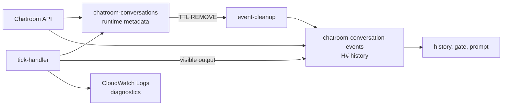

# Conversation Event Storage Design

## TL;DR

The following decisions are locked for implementation:

- Move history out of the growing `events` list into
  `chatroom-conversation-events`, one event per DynamoDB item.
- Keep `chatroom-conversations` as application/runtime metadata.
- Use `conversation_id` as the messaging-history identity and event partition
  key.
- Use the activity-agnostic key
  `H#T{timestamp}#B{batch_id}#I{index}`. Never put episode in the key or make
  core history writes/queries depend on it; an application may attach it as
  optional event metadata.
- `timestamp` is the server-assigned history/availability time. Remove
  `visible_at`; delayed AI messages are written only after waiting and may add
  optional `authored_at`.
- Message authors use role-specific immutable IDs. AI identity always uses the
  conversation-scoped `ai_participant_id`, not a display or internal name.
- Persist only participant-facing `H#` history. Reserve `A#`, but send current
  tick/inference diagnostics to CloudWatch Logs with 30-day retention.
- Keep scheduling state in compact conversation metadata, never in logs.
- Read history with opaque forward/backward cursors. Application activity
  periods use start/end cursors rather than storage partitions.
- Keep numeric-timestamp `after` compatibility through the documented
  cache/session/JWT window and rollout soak; maintenance duration alone does
  not expire JavaScript already loaded by an open page.
- Retention belongs to the metadata row. Event items have no TTL; metadata TTL
  removal triggers partition cleanup. Enable PITR and `RETAIN`.
- Rehearse on restored tables, then use a short beta write freeze for cutover.
  Keep the legacy `events` list through initial soak.

The shared beta cutover completed on 2026-08-15. The API and tick Lambdas now
read and write `chatroom-conversation-events`; legacy embedded lists remain
unchanged for rollback evidence but receive no new events. Numeric `after`
compatibility remains enabled during soak. See the
[cutover worklog](./migration-cutovers/2026-08-15-event-storage-beta-cutover-worklog.md).

Resume behavior is still isolated and was not released with this migration.

## Scope

This feature creates the durable messaging-history layer required before
resumable conversations. Participant identity, connection supersession, AI
activity lifecycle, and final adaptive tick scheduling remain in
[`feat-resume-conversation.md`](./feat-resume-conversation.md) or later runtime
work.

The messaging layer owns ordered history, audience, cursors, and retention.
The chatroom AI application owns tick state, connections, settings, and any
concept such as episode/run/huddle. Extracting the messaging layer into a
standalone service does not change its `conversation_id` identity.



## Locked Storage Contract

### Conversation metadata

Keep `chatroom-conversations` and its `status-index`. Add:

```text
event_storage_version = 1
ai_tick_state_by_participant_id
next_actionable_tick_at
```

The metadata row remains authoritative for lifecycle, participants, settings,
tick ownership, and retention. Keep the legacy `events` attribute through the
initial cutover; remove it conditionally only after the soak period.

Enable PITR and use `RETAIN`. Longitudinal research history must not disappear
because a stack is replaced or deleted.

### History table

```text
table: chatroom-conversation-events
PK: conversation_id (String)
SK: event_key       (String)
billing: PAY_PER_REQUEST
PITR: enabled
removal policy: RETAIN
GSI: none
item TTL: none
```

Required event envelope:

```text
conversation_id
event_key
event_id
event_stream             # history; audit is reserved
schema_version           # initially 1
type
subtype                  # optional
audience                 # conversation or selected participants
role                     # human, ai, or system for message-like events
session_id               # optional human source session
participant_id           # optional resumable-human identity
ai_participant_id        # optional stable AI identity
episode_number           # optional opaque application metadata
sender                   # display-name snapshot
internal_name            # optional AI label snapshot
timestamp                 # canonical history time, epoch ms
authored_at               # optional pre-delay production time, epoch ms
turn_id                    # optional model-turn grouping across delayed writes
created_at                # server persistence time, ISO 8601
...message/system payload
```

Author identity is a role-specific union:

- Non-resumable human: `(human, session_id)`.
- Resumable human: `(human, participant_id)`; also retain `session_id` as the
  source connection/session. The server derives both fields, never the message
  request body.
- AI: `(ai, ai_participant_id)`. Generate the ID when the conversation is
  created, bind it to the resolved persona snapshot, and preserve it across
  episodes. `internal_name` and `sender` are labels, not identity.
- System: `role=system`; no individual author ID is required. Use `subtype` for
  machine-readable semantics.

No cross-conversation event query is required, so do not add a GSI.

### Event key and identity

```text
H#T{timestamp:016d}#B{batch_id}#I{index:03d}
A#T{timestamp:016d}#B{batch_id}#I{index:03d}   # reserved, not written now
```

- `H|A` separates participant history from a possible future durable audit
  access pattern.
- `T` gives server-assigned chronological ordering. Padding preserves lexical
  order.
- `B` is a UUID shared by one atomic write. Retain it across retries and use it
  as the DynamoDB transaction idempotency token.
- `I` preserves order within a batch and prevents same-millisecond collisions.
- `event_id` is `<batch_id>#<index>` and is returned to clients for dedupe.
- Delayed bubbles from one model turn are separate writes and share an optional
  `turn_id`; do not overload the storage transaction ID for this grouping.

History order is the server-assigned `timestamp`, followed by the event key.
Within a batch, `index` preserves order. Separate batches with the same
timestamp use deterministic but otherwise arbitrary `batch_id` ordering; no
stronger cross-batch causal or FIFO guarantee is promised.

Do not use episode in the key. It is an AI application lifecycle concept and
may be renamed or replaced. Core writes and queries remain conversation/cursor
based and treat an optional `episode_number` as opaque payload. Live polling
already reads after a cursor; scrollback reads before one; an
application-owned active period is the range between its stored start/end
cursors. An application-level episode API may translate an episode to those
cursors and call the generic range query without changing the storage key.

### Time semantics

`timestamp` has exactly one meaning: where and when the event appears in
conversation history. It controls sort order, API availability, rendering,
gate input, and prompt history, and must be server-assigned.

There is no `visible_at` in the new schema.

- Immediate human/system event: `timestamp = now`; omit `authored_at`.
- Delayed AI event: wait first, then assign `timestamp = server now` and append;
  `authored_at` is when the model output was produced.
- `authored_at` never controls ordering or delivery.
- Group one delayed model turn by `turn_id`, not either timestamp.

Example: a turn produced at `12:00:00` may be appended at `12:00:02` and
`12:00:05`; both events have `authored_at=12:00:00` and the same `turn_id`.

The tick handler holds a conversation-level tick lease while it waits. Every
append requires the same active tick ID and active conversation status. If the
conversation ends or ownership changes before a delay finishes, the remaining
output is dropped; usage for the completed inference is still retained. Newly
generated messages are therefore never stored with future timestamps. Migration
may preserve future timestamps that the legacy runtime had already accepted.

### History versus diagnostics

Persist `H#` items for human/AI messages and participant-visible system/error
events. `type`, `subtype`, and `audience` carry semantics; do not create a new
key namespace for every event type.

Do not persist `A#` in Phase 1. Gate skips, silent/spoke decisions, inference
failures, and lobby diagnostics use versioned structured CloudWatch logs.
Configure 30-day retention. Logs must not include prompts, message content,
credentials, or raw researcher participant IDs. RDS usage rows remain the
billing source of truth.

`A#` remains reserved so durable audit can start later without a key migration.
No historical log backfill or admin audit API is required.

### Tick state

CloudWatch is diagnostic telemetry, never application state. Persist the latest
completed per-AI decision in metadata:

```json
{
  "ai_tick_state_by_participant_id": {
    "ai_001": {
      "last_completed_tick_id": "uuid",
      "last_evaluated_at": 1753420000000,
      "last_result": "silent",
      "observed_history_cursor": "H#...",
      "consecutive_silent_count": 1,
      "next_actionable_at": 1753420010000
    }
  },
  "next_actionable_tick_at": 1753420010000
}
```

- `last_result` supports `silent`, `spoke`, and `error`.
- A gate-only skip logs diagnostics but does not replace a completed AI
  decision.
- A silent/error result with no visible output updates metadata only.
- Delayed bubbles commit independently after their waits. The active tick lease
  prevents another tick from running before the final projection update.
- CloudWatch delivery is intentionally not atomic with DynamoDB.
- The existing pre-gate tick guard remains separate. Its crash gap is deferred
  to the tick-ownership refactor.

Prompt construction may turn this projection into a compact sentence such as
"You chose to stay silent and no new message has arrived." It must not read
CloudWatch diagnostics.

## Write and Read Contract

Expose explicit storage operations:

```python
create_conversation(metadata, history_events, batch_id)

append_history_batch(
    conversation_id,
    history_events,
    batch_id,
    metadata_updates=None,
    expected_status=None,
)

update_tick_projection(
    conversation_id,
    ai_participant_id,
    tick_state,
    expected_status=None,
)

query_live_after(conversation_id, after_cursor, now_ms, limit)
query_history_before(conversation_id, before_cursor, now_ms, limit)
query_prompt_events(conversation_id, now_ms)
```

Write rules:

- Conversation creation transactionally writes metadata and initial `H#`
  events.
- A history append transactionally updates metadata/TTL and writes its `H#`
  items.
- Visible AI output includes its tick projection in that transaction.
- Projection-only tick updates and the tick guard do not change `updated_at` or
  refresh retention TTL.
- Retry a logical write with the same `batch_id`.
- Repeated client sends remain at-least-once until `client_message_id` exists.

Public cursors are opaque base64url JSON and include version, stream,
conversation, and event key:

```json
{
  "v": 1,
  "stream": "history",
  "conversation_id": "conv_...",
  "event_key": "H#..."
}
```

The server validates cursor stream/conversation against the authenticated
conversation. Cursors are navigation state, not credentials.

API behavior:

```http
GET /chat/messages?after=<cursor>&limit=100
GET /chat/history?before=<cursor>&limit=50
```

- Live polling returns `H#` events with `timestamp <= now` after the cursor and
  returns `next_after`.
- During widget migration, `after` accepts either the new opaque cursor or the
  legacy integer timestamp. Responses keep the legacy `events` shape and add
  cursor fields so both widget versions work.
- Scrollback returns the newest/backward page in display order with
  `next_before`, `has_more`, and `latest_cursor`.
- Initial widget entry loads the newest page and uses `latest_cursor` for live
  polling.
- Return `event_id`; sender/content/timestamp dedupe is migration fallback only.
- Use strongly consistent reads for live history and prompt construction.
- Prompt/gate queries read only `H#`; diagnostics never enter model history.

The AI application may store `history_start_cursor` and `history_end_cursor`
for a current activity period, Qualtrics ED, or UI separators. The messaging
store does not interpret those ranges.

## Retention and Cost

- Each accepted `H#` batch or explicit conversation lifecycle action sets
  metadata TTL to `now + 2.5 years`.
- Background tick/projection updates do not refresh TTL.
- Event items have no independent TTL.
- Enable a `KEYS_ONLY` stream on `chatroom-conversations`.
- On metadata `REMOVE`, `event-cleanup` queries and batch-deletes the event
  partition. Cleanup is idempotent and has failure alarms.
- DynamoDB TTL is asynchronous; deletion may lag expiration by several days.

Rough list-price estimate for a 10-minute conversation with 100 messages and a
five-second tick cadence:

```text
30-day inactivity TTL comparison:    about $0.0015 per conversation
selected 2.5-year inactivity TTL:    about $0.0033 per conversation
```

This excludes Bedrock, which dominates. The 30-day figure is a comparison, not
a retention decision. Measure actual item size and consumed capacity before
budgeting. See [DynamoDB pricing](https://aws.amazon.com/dynamodb/pricing/).

## Implementation Map

Backend:

- add real/mock event-store adapters and cursor helpers
- keep Dynamo adapters focused on conversation metadata
- move lobby/create, human-send, AI output, and visible system events to `H#`
- change gate/prompt builders to receive queried history explicitly
- replace durable tick events with metadata projections and structured logs
- add backward history API and return opaque cursors/event IDs

Frontend/widget:

- replace timestamp polling state with opaque cursors
- retain the legacy timestamp-polling server path during the cache transition
- load newest history, then page backward on scroll
- use canonical `timestamp`; remove `visible_at`
- render application boundary events/ranges without episode-aware storage
- dedupe by `event_id`

CDK:

- add event table, grants, environment variables, and PITR/`RETAIN`
- add metadata stream, cleanup Lambda, failure alarm, and history route
- configure 30-day diagnostic log retention
- extend infrastructure snapshots

Docs:

- update `design.md`, `low-level-design.md`, and `api-reference.md` in the
  runtime cutover commit, not before

## Migration and Rollout

### Migration command

The tool must support:

```text
--dry-run
--apply
--verify
--confirm-plan <full-hash>
--cutover-at-ms <fixed timestamp>
--report-json <local path>
```

It must be deterministic, checkpointed, idempotent, and unable to mutate
without the exact plan hash. The fixed cutover timestamp participates in that
hash. Malformed source rows block apply; standalone verify is read-only and
also rejects missing, conflicting, or extra target partitions.

Legacy mapping:

```text
new.timestamp   = old.visible_at ?? old.timestamp
new.authored_at = old.timestamp, only when different
new.ai_participant_id = old.ai_participant_id ?? old.session_id, for AI only
```

Persist only participant-visible history. Count discarded tick diagnostics.
Legacy human events remain non-resumable and retain `session_id`; system events
have no author ID.
Before dropping them, derive each AI's latest completed result into metadata
and set `next_actionable_at` to cutover time.

### Rehearsal

1. Deploy table/permissions/cleanup/logging without switching runtime traffic.
2. Restore an on-demand metadata backup into a rehearsal table and create a
   separate rehearsal event table.
3. Dry-run and review malformed rows, history/diagnostic counts, item sizes,
   and plan hash.
4. Apply, verify per-conversation counts and canonical hashes, then rerun to
   prove idempotency.
5. Run API, prompt, delayed-message, cursor, cleanup, and browser-preview tests
   against rehearsal data.
6. Record duration and findings; use them to set the maintenance window.

### Beta cutover

1. Block new joins and confirm no active conversation. Postpone if one exists.
2. Disable heartbeat and put chat writes into maintenance mode.
3. Create a final backup.
4. Generate and explicitly confirm a fresh live plan hash.
5. Apply and verify counts, hashes, discarded diagnostics, and projections.
6. Set `event_storage_version=1`; keep legacy `events` unchanged.
7. Deploy new readers/writers with dual cursor/integer `after` support and run
   acceptance checks while writes remain blocked. Keep E2E duration below one
   minute.
8. Re-enable API and heartbeat only after all checks pass.
9. Deploy the cursor widget, then retain numeric-timestamp `after`
   compatibility. A maintenance window does not expire JavaScript already
   loaded by an open page. Keep compatibility through the longer of the
   current three-hour JWT lifetime or the GitHub Pages 10-minute cache
   freshness plus the longest supported active widget session, and until the
   rollout soak shows no legacy traffic.
10. After that compatibility window and soak, remove numeric timestamps other
    than any explicitly retained initialization sentinel, then conditionally
    remove legacy lists.

Before traffic reopens, rollback is the legacy runtime plus its untouched
embedded lists. After event-table-only writes are accepted, the legacy writer
is unsafe; stop writes and fix forward instead.

## Acceptance Criteria

- Keys order by canonical timestamp/batch/index; equal-timestamp batches have
  deterministic arbitrary order and do not skip or duplicate events.
- Newly generated events are never pre-written with future timestamps; migrated
  legacy future events remain unavailable until their preserved history time.
- Delayed AI messages retain optional `authored_at` and group by `turn_id`.
- Only `H#` is persisted; diagnostics are structured/redacted CloudWatch logs.
- Silent ticks update projection without writing an event; gate skips do not
  overwrite the last completed decision.
- Tick ownership remains valid through inference, delay, append, and projection.
- Forward/backward cursor pages have no gaps or overlap.
- Cached legacy widgets can continue numeric-timestamp polling during rollout.
- Prompt/gate behavior matches the legacy visible-history behavior.
- Migration dry-run/apply/verify is deterministic and idempotent; counts and
  canonical hashes match.
- Local/rehearsal/beta browser E2E can create a chatroom, launch a preview,
  exchange messages, refresh history, and page backward.
- Metadata expiry removes the event partition through cleanup.

## Delivery Order

1. Infrastructure, event-store adapters, and tests.
2. Backend/frontend cutover implementation and local isolated E2E.
3. Restored-table migration rehearsal and report.
4. Resume development and isolated dev E2E may proceed on the new history
   layer before the live migration.
5. Beta maintenance migration, acceptance checks, reopen, and soak. Resume
   must not be released to beta before this cutover succeeds.
6. Conditional legacy-list and numeric-polling cleanup after their respective
   compatibility windows.

## Rejected and Deferred

Rejected one-way-door alternatives:

- **Keep the embedded list:** growing-item rewrites and the 400 KB limit block
  longitudinal history.
- **S3 per activity period:** introduces archive state/recovery and coarse
  pagination without reducing required DynamoDB metadata work.
- **Episode in event key/schema:** permanently couples messaging history to a
  replaceable AI lifecycle concept.
- **Zero-downtime dual writes:** adds compatibility modes, online backfill, and
  shadow reads. Beta accepts a measured short maintenance window.
- **Per-event TTL:** older history could expire while later activity extends the
  conversation. Metadata-controlled partition cleanup preserves one policy.
- **Durable `A#` now:** no hard audit requirement justifies permanent volume and
  API surface.

Deferred two-way doors:

- `client_message_id` send idempotency
- durable `A#` retention and admin API if required
- adaptive tick ownership/crash recovery
- rolling summary/recent-message prompt context
- private-event delivery indexes if private traffic becomes common
- S3 cold archive/export
- extracting a standalone messaging service
