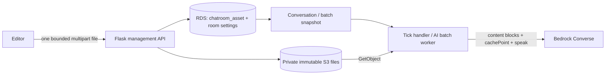

# Feat: Prompt Attachments

Status: implemented and verified locally plus isolated cloud integration (2026-09-13).
Existing customer deployments remain unchanged. Shared-RDS asset schema and usage
verification are complete in isolated dev integration; see the integration worklog.

## TL;DR

Add TXT, PDF and images alongside chatroom/persona prompt text. Keep immutable
files in private S3, ownership in RDS, and send native content blocks before our
existing cache boundary. No vector database, Knowledge Base, OCR pipeline or
automatic summarization in v1. No content deduplication or automatic file
compression/splitting: reject unsupported inputs and ask users to prepare them.

Enable all Anthropic models supporting TXT/PDF/PNG/JPEG on our inference route,
not only Sonnet 4.6. The whole-room model gate below applies even to persona files.
Five current catalog models passed four-format request acceptance probes; Sonnet 4
is excluded after AWS denied legacy-model access. Upload/save/browser preview and
short deployed batch/export flows passed. Files still consume context/input tokens.

## User Experience

- Below AI Behavior Prompt (renamed from Additional Prompt, including personas),
  show an Attachments label and a read-only filename list styled as one button.
  Empty placeholder: Upload attachments. Use the maintained editor, not proto `editor/`.
- Keep text fields: researchers explain how to use a style guide, biography,
  chart or reference. Files supplement rather than replace text.
- Chatroom files reach every AI; persona files reach only instances assigned that
  persona. Repeated persona assignments inherit the same files. Input isolation
  does not guarantee secrecy: an AI may reveal its material in public messages.
- Support upload, download and detach; no manual reorder. Show validation/model errors and
  a batch estimate based on a completed Run once. Block Save/Launch for incomplete/incompatible
  selected files. Each room has an attachment library shared by its prompt and
  all personas; uploads belong to this room, not a global user library.
- Clicking the filename list opens all room files oldest first, as checkboxes,
  with Upload new below. Changes immediately update the editor form; there is
  no modal Save/Cancel draft. Closing preserves selections. Page Save persists
  settings; uploads persist immediately and auto-select the uploaded file.
- The persona's outer filename list shows only persona-owned attachments (or
  Upload attachments when empty). Inside its modal, selection displays common
  IDs union persona-only IDs. Common items
  are checked and disabled, never copied into persona data. Adding a common ID
  removes overlapping persona references; removing it removes inherited checks,
  without restoring old explicit choices. Apply normalization on common changes
  and before Save, including older duplicate data. Existing backend union/limit
  validation and asset created_at are sufficient; no API/schema change.
- Remove from prompt only detaches that reference. Add it back from the same
  library without reuploading. One upload can be selected by any three of five
  personas; all reference the same immutable asset ID. No automatic MD5 dedup.
- New rooms must be explicitly saved before upload; show Save chatroom first.
  Do not silently create a room or introduce ownerless draft uploads.
- Interactive and AI-only rooms are supported. Empty lists retain current behavior.
  No participant uploads, URL imports, widget file display or Qualtrics ED changes.
  Large-library retrieval, DOCX/audio/video and automatic extraction are outside v1.

## Architecture and Contracts



Use a dedicated CDK bucket: private, TLS-only, SSE-S3, retain on stack deletion.
Do not reuse the expiring ZIP prefix or public Pages hosting. The earlier 10 MiB
requirement is superseded by native-format limits below (2026-09-13 decision).
Use one file per multipart request through Flask; bound the whole request to
5,000,000 bytes, below API Gateway's 10 MB ceiling, and align proxy/Flask limits.
This avoids a presigned-upload/finalization flow and staging-version management.
Management reserves quota, validates actual bytes/type/hash rather than browser
claims, writes a server-only immutable key and only then marks the asset ready.

### Asset and Settings Schema

One new RDS table, `chatroom_asset`:

```text
id: paid_<uuid> PK             chatroom_id: FK chatroom.id, indexed, required
original_name                 format: txt|pdf|png|jpeg (verified)
byte_size                     sha256
s3_key                        details JSON: page_count / width / height
request_id: unique within room
status: uploading|ready
created_at
```

Settings store ordered IDs, not bytes or caller-supplied URLs:

```text
setting.prompt_attachment_ids: [asset_id, ...]
setting.ai_personas[].prompt_attachment_ids: [asset_id, ...]
```

Implemented POST/action routes, using existing token auth/envelopes:
- `/api/getPromptAttachmentCapabilities`: returns enabled, models and file_limits.
- `/api/uploadPromptAsset`: multipart `chatroom_id`, `file`, `request_id`;
  reserve quota, validate and persist; return ready metadata or a clear failure.
- `/api/getPromptAssets`: JSON `{chatroom_id}`; returns the room library (at most 50),
  including ready files no longer selected by any prompt.
- `/api/getPromptAssetDownload/<id>`: authorize through the owning chatroom,
  then return `{url}`, valid five minutes with the original filename. No standalone delete-asset route.
- `/api/getAiConversationBatch/<id>` includes recorded token/cost totals. The
  removed matching-reference estimate UI/API is not part of the release.
- Existing create/update room APIs validate same-room membership, ownership, readiness, combined limits
  and every effective model. Repeat checks before creating a new run.

### Editor Validation and Model Labels

- For each AI, validate the union of common and its assigned persona's attachment
  IDs: at most 5 files, 10,000,000 bytes and 10 PDF pages. Reused library IDs count
  once; different personas' private files are not all added together. Boundary
  values are allowed. Also retain the 20-distinct-selected-files room limit.
- Editor explains combined and individual file limits next to the controls,
  blocks invalid modal selections and rechecks before Save or Run. Management
  and runtime remain authoritative validators.
- `getPromptAttachmentCapabilities` exposes `max_effective_files`,
  `max_effective_bytes`, `max_pdf_pages`, `max_room_files` and `file_limits`.
  Both model dropdowns use its enabled allowlist for attachment badges, not a
  separate browser list. Caching badges remain. All effective models must
  support attachments, including personas not picked for a particular run.
- Real Bedrock Converse rechecked on 2026-09-19: Sonnet 4.6, Sonnet 4.5, Haiku 4.5,
  Opus 4.6 and Opus 4.7 accepted the mixed four-format/tool request. Sonnet 4 was
  again denied as legacy for this account and remains excluded. Local management
  reads the deployed dev worker's allowlist rather than its old Sonnet-only
  setting. Production promotion must configure matching management/runtime
  allowlists; no automatic expansion to untested models. Opus 4.7 omits temperature.
- AWS permits five documents up to 4.5 MB each, and images up to 3.75 MB/8000 px;
  our combined-file/byte/page caps are intentionally stricter product limits.
  Sources: [Converse message limits](https://docs.aws.amazon.com/bedrock/latest/APIReference/API_runtime_Message.html),
  [Sonnet 4.6](https://docs.aws.amazon.com/bedrock/latest/userguide/model-card-anthropic-claude-sonnet-4-6.html),
  [Opus 4.7](https://docs.aws.amazon.com/bedrock/latest/userguide/model-card-anthropic-claude-opus-4-7.html).

Create an uploading row, write a new immutable object, then mark ready, within
one bounded transaction holding the room lock. Rollback releases reserved quota;
a successful S3 PUT followed by a failed DB commit can leave an orphan object.
Orphan reconciliation is separate future maintenance, not ready-file cleanup.
Retries reuse committed request IDs; incomplete assets cannot be attached.

### No Content Deduplication

At roughly 200 human-AI and AI-only chatrooms, skip MD5/hash-based upload deduplication. Hashing
is cheap; sharing blobs across rooms would couple independent room deletion and
ownership. Explicit ID reuse inside one room needs no blob reference counts.
SHA-256 remains an integrity/snapshot checksum,
not a unique key or a cross-owner lookup. Separate intentional uploads get
separate IDs/objects. Request idempotency prevents retry duplicates; referencing
an existing same-room asset ID can reuse that asset without content deduplication.
If the same ID is selected in both the shared prompt and the current persona,
include it once per inference (shared order first), and count it once toward
request limits. Different asset IDs with identical bytes are not merged.
Do not allow cross-room references, even for rooms owned by the same user.
Room cloning must copy files to new room-owned assets, or omit attachments with
an explicit warning; it must not retain source-room IDs.

For scale, 200 rooms x five 4 MB files is about 4 GB before retained versions;
even 20 files x 4.5 MB per room is only 18 GB. At an illustrative S3 Standard
$0.023/GB-month, those are approximately $0.09/$0.41 per month of storage,
excluding requests, transfer and retained replacements. Ten retained copies would
be about $0.92/$4.14, not a bounded retention guarantee. A pool can be larger than
one valid AI request: the per-request limits still apply. Saving duplicate storage at this scale does not justify the
lifecycle complexity. S3 deduplication would not reduce Bedrock input tokens:
the same content must still be included in each inference request.

### Snapshot and Retention

Management resolves a trusted asset manifest when snapshotting a batch. Live
runtime resolves against the room and its owner at conversation creation. Snapshot ID, key,
hash, format, size and rendering policy. Preserve persona references through all
normalizers and participant assignment; current dictionary rebuilds would drop
unknown fields. Worker reads snapshots, not mutable room settings.

Replacement gets a new asset ID. Resume keeps its original attachment snapshot.
Fetch bounded bytes, verify hashes, optionally cache by immutable ID/hash within
a byte-bounded process cache. Never store binary content in DDB, settings or SQS.
Missing/corrupt files fail visibly rather than silently changing the experiment.

### Chatroom-Owned Retention (Agreed)

Successfully uploaded attachments remain in the room library until **permanent
chatroom deletion**, whether selected, detached, or never used. Save changes only
prompt references. Inactive/soft-deleted rooms retain files; do not add cleanup
to today's soft-delete endpoint. No used_at pin, delete_after, detach-triggered
timer, or reference-count table. This replaces the proposed six-hour deletion.
Failed/incomplete upload objects may be reconciled separately, but never treat
an unused ready asset as an abandoned upload. Storage quotas include all retained
ready assets, not only files currently selected by prompts.

Conversation data and attachments share the room's deletion boundary. The existing
history TTL of approximately 2.5 years remains an exception for now; removing a
prompt reference or expiry of an individual history event does not delete files.
Resume keeps original settings/attachments while the room exists and is eligible.
Full deletion must disable new activity before retryable cleanup across stores;
its ordering and history-expiry/resume semantics are a separate follow-up:
[STML-28](https://linear.app/petryyy/issue/STML-28/featchatroom-define-room-owned-data-deletion-and-revisit-conversation).
No permanent-delete implementation or TTL change is included in this attachment release.

### Initial Limits and Security

Native admission limits, using conservative decimal bytes (not MiB):
- PDF: **4,500,000 bytes**; PNG/JPEG: **3,750,000 bytes** per file.
- TXT: **100,000 UTF-8 bytes** product cap, not an AWS document limit;
  we decode it into text blocks. Reject invalid/binary content; allow UTF-8 BOM.
- No encrypted PDFs, animation or silent conversion.
  Images: at most 8000 pixels per edge and 16 MP, with bounded decoding.
- Shared plus selected-persona files: five original files and ten PDF pages per
  request (conservative product caps, not AWS's mixed-file/page quotas).
  Proposed combined raw-file cap: 10,000,000 bytes per effective AI request.
  Independently enforce model-native block limits and total serialized
  request/context limits; upload size alone does not establish inference readiness.
- Room library: 50 ready assets / 100 MiB; selected room/persona pool:
  20 distinct asset IDs. Unselected library files do not count toward inference
  limits or affect model eligibility. Library listing/downloading stays available
  even when the current model cannot use attachments.
  Reserve quotas transactionally; throttle uploads even in free inference mode.
- Bound upload/validation memory and execution time independently.

Reject oversize uploads before storing ready assets, and invalid combined inputs
before Save/Launch. Show the actual limit near the attachment UI, for example:
"PDF files must be 4.5 MB or smaller. Please compress or split the file and upload
again." Splitting does not bypass the combined count/page/context limits; users
may need to select fewer sections. No application resizing, PDF splitting, OCR,
alternate inference API or large-file workaround in v1.

### Which Bedrock Limits Apply? (Checked 2026-09-13)

Our worker calls `bedrock-runtime.converse`, not `InvokeAgent`. Agents code
interpretation's five files / 10 MB combined limit is a different API contract.
Converse's Message API documents **five documents** (4.5 MB each) and **20 images**
(3.75 MB each, at most 8000 x 8000 pixels); documents/images require a user message,
and documents need accompanying text. Those are separate counts, not five mixed
files. Our stricter mixed-file cap is a product choice.

All shared plus selected-persona attachments go into one initial user message,
once per request. Validate that combined set for every configured persona;
do not sum files belonging only to other personas into that AI's request.
Repeat the prefix on each inference, but never append binary attachments to
event history. Ten turns therefore repeat the same file payload ten times,
not accumulate ten copies inside one request. Batch conversations have separate
requests; they share account throughput quotas, not a file-count allowance.

Cache hits reduce processing cost, not file limits, request bytes or context
occupancy. Count fixed instructions, tools, files and growing history together.
Binary base64 transport adds roughly one third to byte size. Five maximum PDFs
alone would be about 30 MB encoded, so individual file limits are insufficient.
Use a 16,000,000-byte serialized-request product guard in addition to
the combined raw limit; count the actual SDK JSON, including history and tools.
This is not a claim that Converse guarantees acceptance up to 16 MB: its API
reference does not publish an overall body maximum. Do not transplant the
InvokeModel 25,000,000-byte limit or the direct Anthropic API's 32 MB allowance.
Model context/page limits still apply; surface provider validation failures
without retrying unchanged requests or silently dropping material.

The ten-page product cap is deliberately below the vendor's documented PDF page
ceilings (100 for requests under a 1M context window, otherwise 600). Neither
file bytes nor pages guarantee that a request fits model context. Capability
tests are recorded below; these do not establish acceptance at every maximum
boundary. Vendor context limits and validation still apply.

Validate signatures and bounded decode with maintained libraries, without executing
PDF actions or external links. Validation is not malware scanning. Serve originals
as safe downloads, not executable content on our application origin.

Runtime derives ownership from trusted room/batch records. Never expose manifests,
presigned URLs or file content via widget tokens, polling, ED or error logs. Inspect
Bedrock invocation-log retention too. Global inference processing is not restricted
to Ohio merely because our bucket is there. Do not expand shared production roles.

## Prompt Construction

Preserve the existing no-attachment path. For attachment-bearing requests:

```text
system: fixed instructions and examples
initial user prefix:
  shared topic / Additional Prompt / scope explanation
  shared files in stable order
  selected persona / participants / own name
  selected persona files in stable order
  cachePoint
  current history + existing role-mapped conversation messages
  continuation instruction when needed
tools: existing speak contract
```

TXT becomes decoded text; PDF/image use native document/image blocks. Read S3
bytes server-side; boto3 encodes transport. Do not assume that a generic
`s3Location` schema implies support on every model. Use neutral document names,
not user filenames. Files occur once per request, not in the history duplicate
or in each previous turn.

Document/image blocks stay in a user message. Keep citation settings consistent
across document blocks. Use `citations.enabled=true` for the initial validated
PDF path; this is a tested configuration, not a claim that citations are always
required. Our probe also succeeded with citations off (see results).

### Whole-Room Model Gate (Agreed)

Build a server-owned capability registry covering all supported Anthropic models
with TXT/PDF/PNG/JPEG support on the selected Bedrock API. Do not infer support
from an anthropic prefix or cache support. Cache is an optimization, not a
requirement for attachment eligibility. Keep registry data shared with the editor.

The attachment feature is enabled only when the chatroom default model AND every
configured persona's effective model supports all four formats. Resolve a missing
persona override to the chatroom default. Include personas that might not be
selected for this run; even an overridden/unused room default must qualify.
Unknown or unsupported models disable the feature globally, including persona
attachments, even when only TXT is attached or the offending persona has no files.

Show an error beside shared and persona attachment components, identifying the
offending model(s). Preserve draft attachments so the user can fix the models or
detach them; never silently discard them. Backend create/update/start validation
uses the same predicate. If any files are configured and the predicate fails,
reject the operation, not a text-only run with files ignored. Rooms without any
files remain valid with existing models. Scope remains per persona once enabled.

Cover all eligible models in the current catalog, not just the probed Sonnet 4.6.
Record official support separately from tested combinations; verify output-tool
and model-parameter compatibility during implementation. Do not declare all
Anthropic models tested based on this one JPEG/PDF probe.

Explain that materials supplement researcher instructions but cannot override
platform/tool/access rules. Delimiters are not a security boundary. An AI never
receives other personas' attachments or server secrets.

## Cache, Cost and Export

Put stable bytes/order before the checkpoint; exclude signed URLs, time and
random labels. Budget separate per-AI warmups, not guaranteed cross-conversation
reuse. Five-minute expiry, routing and eviction can add writes. Cached content
still occupies context.

### Historical: Matching-Reference Estimate (Superseded 2026-09-20)

The matching-reference UI and endpoint below were removed. Current behavior is
to recommend Test once and display each batch's actual recorded usage/cost;
there is no automatic configuration matching or projected-batch-cost lookup.
The remaining text records the original design rationale, not active behavior.

Use only an observed completed run, not PDF size, page count, assumed token
counts, or a pre-inference CountTokens call, to estimate batch inference cost.
The PDF probe illustrates why: the larger one-page file used fewer input tokens
than the smaller three-page file. No statistical estimator or future averaging
roadmap is included.

1. User explicitly starts Run once with the saved configuration. This is a real,
   charged conversation, not a hidden counting request.
2. After normal completion, sum all recorded inference costs for that conversation:
   ordinary input, cache writes/reads and output, including silent attempts and
   corrective/retry calls for which usage is available. Use stored write-time
   estimates; do not retroactively reprice old usage.
3. Display the reference cost and `estimated batch cost = reference cost * N`,
   where N is the number of new conversations. The already-run reference is not
   included in this new batch estimate.
4. Also show message count, total characters, inference count and completion
   reason, so the user can judge whether the reference is representative.

Example: "Last completed run: $0.18. Estimated for 10 new conversations: ~$1.80."
Label this as provider-reported usage multiplied by configured prices, not the
final AWS bill, a spending limit, or a guaranteed cost. Different trajectories,
silence/retries and cache behavior can change actual spending. Do not assume
additional cross-conversation cache savings.

Use the latest successful Run once matching the same owner, chatroom and saved
generation configuration: models, temperatures, persona pool, attachment hashes
and order, prompts, mimic behavior, and length/turn limits. Ignore transport IDs,
creation timestamps and display-only settings when comparing. Mark the reference
stale after a generation-setting change; never silently reuse it.

Failed, timed-out or cancelled runs are not eligible. Neither are runs with
missing usage, unknown prices, or known unaccounted billed attempts. Current
usage records carry conversation_id. The implementation searches the latest 50
owner batches for an eligible matching single-run snapshot and sums its ledger rows.
It rejects missing/unknown-price rows and fewer recorded calls than messages. Never present
missing cost as zero. Our adapter's internally retried failures may not expose
provider usage; disclose that limitation rather than claim exact billing.

No eligible reference: show "We recommend running one conversation first to
estimate the cost of a batch run." Do not run it automatically. **Run once is
not mandatory**: Start batch remains available; billing authorization is separate.

Expose the owner-checked reference cost, conversation ID, completion metrics and
configuration match through the existing management batch API surface; browser
multiplication is display logic, not the authoritative source of usage. Reuse
existing input/cache/output accounting and avoid double-counting image tokens.

File byte/page limits remain admission safeguards, not cost estimators. Enforce
serialized request limits and handle model context overflow explicitly without
silently truncating material. CountTokens support is not a prerequisite for this
feature. Storage/transport costs are separate and not included in the run-based
inference estimate.

Extend `info/prompt.md` with ordered names, scope, hashes, format and rendering
policy; inline bounded TXT. Describe binary inputs without inventing textual
equivalents. Original binary export can wait. This remains an initialization
reference, not every inference's actual request.

## Delivery Plan

### Execution Checklist

- [x] Lock room-owned library, immutable snapshots and no detach deletion.
- [x] Management: model/migration, upload/list/download/capabilities, same-room
  validation, snapshot resolution, ownership/quota/idempotency tests.
- [x] Runtime: preserve persona IDs, resolve snapshots at creation, attach in
  tick and batch, redact public payloads, fail closed when feature disabled.
- [x] Maintained editor: shared library modal, multipart upload, model errors,
  reference persistence and no-file regression tests/build.
- [x] Local full flow: save room, upload, reuse/detach/re-add, human-AI and batch.
- [x] Isolated deployed integration: new names/resources only, bounded inference,
  resource inventory and cleanup; record evidence separately from unit tests.
- [x] Recheck protected hosted asset identity and endpoints; report remaining gaps.
- [ ] Explicit production release: apply shared-RDS schema, configure bucket/IAM
  and verified models, coordinate management/runtime/editor rollout. Not authorized here.

Do not deploy to existing beta/prod management, runtime, or Pages. The currently
served stimulize-beta asset is `main.95eb5b04.js` (read-only baseline); do not infer
its feature set from a local branch. Feature flags default off, and capability
lists remain empty unless the deployment explicitly enables verified models.

### Implementation Decisions (2026-09-13)

Both human-AI and AI-only attachment support ship together. Human-AI cost
projection is separate follow-up [STML-27](https://linear.app/petryyy/issue/STML-27/featchatroom-estimate-human-ai-study-cost-from-a-completed-test).
Do not make it a prerequisite for uploads or human-AI launch.

- **Management owns assets:** one `chatroom_asset` table and one private bucket;
  small Flask upload/list/download routes call a plain asset service.
  Keep validation and lifecycle logic out of route bodies; no new top-level
  package, generic storage framework or content-addressed blob layer.
- **Runtime owns assembly:** one `prompt_attachments.py` helper validates manifests,
  loads bounded immutable bytes and inserts native blocks before the first cache
  checkpoint. Both tick and batch worker call it. No-cache models get an initial
  user attachment message; do not move files into system text or require caching.
- **Trusted manifests:** client settings contain only IDs. Management/batch start
  and direct-RDS conversation creation resolve IDs with same-room and owner
  checks, and snapshot immutable metadata. Never trust caller-provided S3 keys.
  No use-time pin or cross-store reference accounting is required.
  Snapshot field `_prompt_asset_manifest` maps IDs to `{id, format, byte_size,
  sha256, s3_key, original_name?, page_count?, width?, height?}`; object keys are `assets/<asset_id>`
  in the server-configured bucket. Reject this private field in user write APIs.
  DynamoDB numeric metadata may be integral Decimal; normalize without accepting
  fractional sizes. Attachment-only persona entries must survive normalization.
- **Human-AI boundaries:** lobby close snapshots assets before conversation
  creation. A failed lookup must fail attachment-bearing creation, not fall back
  to settings without files. Freeze settings/files throughout the conversation
  and all resumed episodes. Human-to-AI replacement and shuffled persona rounds
  preserve selected persona attachment IDs. Attachment-only personas are valid.
- **No browser disclosure:** auth/resume/live responses must remove attachment
  IDs/manifests from public settings and participant projections. Files are AI
  inputs, not downloadable participant resources. Widget history/ED are unchanged.
  Existing text-prompt visibility is not broadened or redesigned in this feature.
- **Realtime behavior:** bounded S3 reads and clear permanent errors; no retry
  storm when an asset is missing/corrupt or context is full. A tiny file can still
  consume many tokens. Human pauses can expire cache entries; Run once estimates
  from AI-only conversations are not interchangeable with human-AI estimates.
- **UI:** one reusable attachment-list component for room/persona; capabilities
  come from backend. Upload one file/request, validate the whole room, and preserve
  draft references until Save. Hide controls when feature configuration is absent.
- **Release isolation:** default off. New named test bucket, isolated runtime/DDB,
  local management database and local maintained editor first. Never change hosted
  stimulize-beta assets, its management deployment, existing room rows or shared
  IAM roles for integration tests. Keep test inferences below one minute and batch
  size <= 2 / max_turns <= 4. A production migration/deployment is a later explicit
  action; an isolated cloud probe is not a claim of hosted upload E2E success.

Validation order: pure contracts/assembly tests; management ownership/save/library
tests; no-file regression tests; local editor upload and human-AI/batch preview;
isolated S3 + Bedrock integration; then isolated full API/worker integration.
Test cold and cached prefixes, persona isolation, resume after room-file removal,
request limits and permanent errors. Publish only model/format capabilities that
are verified for the selected route; never infer them from cache eligibility.

### Current Implementation Evidence

- Management, direct-RDS snapshot resolution, tick/batch assembly and maintained
  editor are implemented. Feature defaults off. Additive `chatroom_asset` schema
  was explicitly applied to shared RDS on 2026-09-13. `chatroom_usage` schema was
  unchanged. Follow-up real-RDS tests use dedicated test rooms and only the
  attachment-dev runtime; customer deployments remain unchanged.
- Local management uses SQLite; its editor calls a new isolated AWS runtime,
  DDB tables, queues and private S3 bucket. Human preview returned a correct image
  description. A one-conversation/two-turn batch completed, and downloaded ZIP
  TXT/JSON plus attachment prompt reference were checked. See
  [integration worklog](prompt-attachments-integration-worklog.md).
- 305 runtime tests, 43 management tests, 42 maintained-editor tests and 19 CDK
  tests passed. Editor typecheck/build and widget build passed. Existing unrelated
  CRA warnings and short JWT fixture warnings remain.
- Browser upload/save, shared-to-persona reuse, download byte equality and
  desktop/mobile library layout passed. Resume regression proves removal from
  room settings does not refresh a previous conversation's file snapshot.
- Sonnet 4.6/4.5, Haiku 4.5, Opus 4.6/4.7 accepted native PDF/JPEG/PNG plus TXT
  context with the speak tool. Opus 4.7 requires omitting temperature; runtime and
  editor handle this. Sonnet 4 was denied by AWS as a legacy model not used in the
  previous 30 days, so it is excluded from this deployment's capability list.
  These are route acceptance probes, not an exhaustive visual-quality evaluation.
- `backend/scripts/probe_attachment_storage.py`: opt-in, new private temporary
  S3 bucket -> immutable JPEG -> shared assembler -> Bedrock Converse. Tested
  human-AI and AI-only scaffolds on global Sonnet 4.6, one call each, both parsed
  through `speak` and described the supplied cup image correctly. Calls took
  7.23/7.12 seconds; estimated costs $0.010731/$0.01051725 (total $0.02124825).
  Both were cache writes, not a cache-hit test. Temporary object/bucket deleted.
  No RDS/DDB, application usage/billing rows, IAM roles, Lambdas or hosted sites
  were changed. Raw report remains in gitignored
  `.local/prompt-attachments/s3-bedrock.json`.

Observed-run cost selection and UI multiplication are implemented and tested with
known ledger fixtures. Isolated cloud workers intentionally use mock RDS, so the
end-to-end estimate correctly has no priced reference; it is not reported as $0.
Live PostgreSQL ledger integration remains a coordinated release check, not a
reason to write test usage into the shared database. Current static prompt source
changes are not compared by management; estimates match saved generation settings,
not a promise of identical deployed templates or outputs.

Regression cases: fake MIME, invalid UTF-8, encrypted/corrupt/scan PDF, oversized
decoded image, foreign owner, retry, retired/missing asset, reordered files,
context overflow, S3 failure, repeated persona/model overrides, immutable
resume/batch data, export regeneration and no participant-facing leaks. Cost tests: same-config match, stale/missing
reference, failed runs, incomplete usage, cache-category sums and N new runs.

Size policy is settled: native limits, no large-file preparation. Product safety
caps above are implementation defaults. Files remain in the room library
until permanent room deletion; no full builder snapshot or semantic extraction pipeline.

## PDF Verification (2026-09-12)

Standalone script: `backend/scripts/probe_pdf_vision.py`. Plan-only unless
`--invoke`; one/two short inferences, no automatic retry. Uses our actual AI-only
scaffold, cache builder, forced single-message speak schema and parser. No
conversation creation, infrastructure change or application usage/credit DB writes.
These direct calls still incur AWS charges.

```bash
cd backend
PYTHONPATH=. python scripts/probe_pdf_vision.py /path/to/file.pdf \
  --question 'Ask a verifiable visual question without supplying its answer.' \
  --output ../.local/pdf-vision/result.json --invoke
# Optional comparison: --citations off --repeats 1
```

Both original PDFs were inspected as rendered pages; questions did not supply
answers. The test used full PDFs, not extracted text or screenshots:
- Hiking map: 2,807,943 bytes, one page, only 516 locally extractable characters.
  Verified route-map layout, solid bus versus dotted hiking lines, green mascot
  bubble advertising LINE stickers, and revision date 2025-04-01.
- 2DU10: 161,437 bytes, three image-only pages (zero extracted text). Verified
  spectral peak near 700 nm, non-monotonic rise with a local bump/dip, and 100K
  amplifier feedback resistor against page 2. Precise tiny-text/table extraction
  across the whole documents was not tested.

| PDF, citations on | Call | Uncached input | Cache write | Cache read | Output | Est. USD |
| --- | --- | ---: | ---: | ---: | ---: | ---: |
| 2DU10 | First | 112 | 8,566 | 0 | 114 | $0.034169 |
| 2DU10 | Repeat | 112 | 0 | 8,566 | 111 | $0.004571 |
| Hiking map | First | 118 | 5,782 | 0 | 125 | $0.023912 |
| Hiking map | Repeat | 118 | 0 | 5,782 | 124 | $0.003949 |

Counts include platform instructions/setup/tools and PDF, not PDF-only tokens.
Larger byte size did not mean more tokens. All four outputs parsed as speak;
both repeats reused the full cache prefix. This demonstrates compatibility, not
a guaranteed cache hit rate or broad visual accuracy benchmark.

Citations-off controls also answered the visual questions correctly and parsed
as speak. 2DU10 used 112 uncached input + 8,082 cache-write + 107 output tokens
($0.032249); hiking used 118 + 5,282 + 135 ($0.022187). Neither was a cache read.
Thus enabling citations is compatible but was not necessary for visual access
in these two examples. The difference is not proof of universal behavior or
complete document comprehension. All six calls cost approximately **$0.121034**
at configured rates, excluding any external discounts/taxes. Calls are not present
in application usage statistics because this standalone probe bypasses that DB.

CountTokens rejected both files with "The provided model doesn't support counting
tokens." This is the tested `global.anthropic.claude-sonnet-4-6` / `us-east-2`
bedrock-runtime route, not a claim about all token-counting APIs.
Raw answers/usage/request IDs stay in gitignored `.local/pdf-vision/`; supplied
PDFs and screenshots are not committed.

### JPEG Verification (2026-09-13)

The same script now also accepts PNG/JPEG native image blocks. Tested original
`test-img.jpg` (1,689,048 bytes, 3400 x 3400), without application resizing, on
global Sonnet 4.6 in us-east-2. Questions did not reveal answers. Both calls
correctly described two white takeaway cups, dark lids, cardboard sleeves, the
right cup's visible sip opening/seam, and absence of a printed logo. This matches
manual visual inspection, not merely successful HTTP/tool output.

| Call | Uncached input | Cache write | Cache read | Output | Estimated USD |
| --- | ---: | ---: | ---: | ---: | ---: |
| First | 109 | 4,851 | 0 | 91 | $0.01988325 |
| Repeat | 109 | 0 | 4,851 | 92 | $0.00316230 |

Both responses parsed as single-message speak calls. Total **$0.02304555**;
tokens include platform prompt/tool overhead, not just the JPEG. CountTokens was
unsupported again. JPEGs do not have a citations flag. Raw output is local-only
at `.local/pdf-vision/test-img-visual.json`. No app DB/deployment changes.
This validates JPEG on Sonnet 4.6, not oversized-file preparation or all models.

## References

- [API Gateway payload limit](https://docs.aws.amazon.com/apigateway/latest/developerguide/api-gateway-execution-service-limits-table.html)
  is separate from Bedrock inference limits; bounded single-file multipart fits.
- [Agents code interpretation](https://docs.aws.amazon.com/bedrock/latest/userguide/agents-code-interpretation.html)
  is not our inference route. The user-linked re:Post question returned HTTP 403
  during review; limits above come from official API documentation instead.
- [Converse](https://docs.aws.amazon.com/bedrock/latest/APIReference/API_runtime_Converse.html)
  does not document an overall request-body byte maximum.

- [Bedrock content limits](https://docs.aws.amazon.com/bedrock/latest/APIReference/API_runtime_Message.html)
  and [document blocks](https://docs.aws.amazon.com/bedrock/latest/APIReference/API_runtime_DocumentBlock.html).
- [Vendor PDF guidance](https://platform.claude.com/docs/en/build-with-claude/pdf-support):
  its citations/text-only distinction is not universally consistent with this
  Sonnet 4.6 probe; test the selected route rather than infer behavior.
- [Caching](https://docs.aws.amazon.com/bedrock/latest/userguide/prompt-caching.html),
  [token counting](https://docs.aws.amazon.com/bedrock/latest/userguide/count-tokens.html).
- [Sonnet rates](https://platform.claude.com/docs/en/models/sonnet-4-6/overview),
  [vision sizing](https://platform.claude.com/docs/en/build-with-claude/vision),
  [S3 pricing](https://aws.amazon.com/s3/pricing/).
